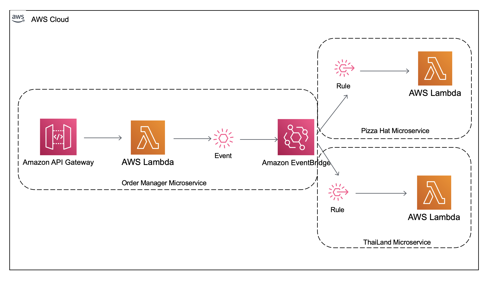
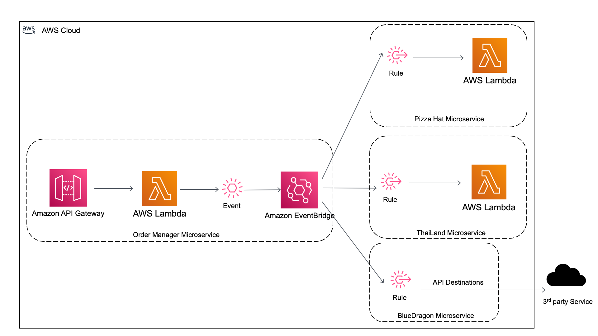
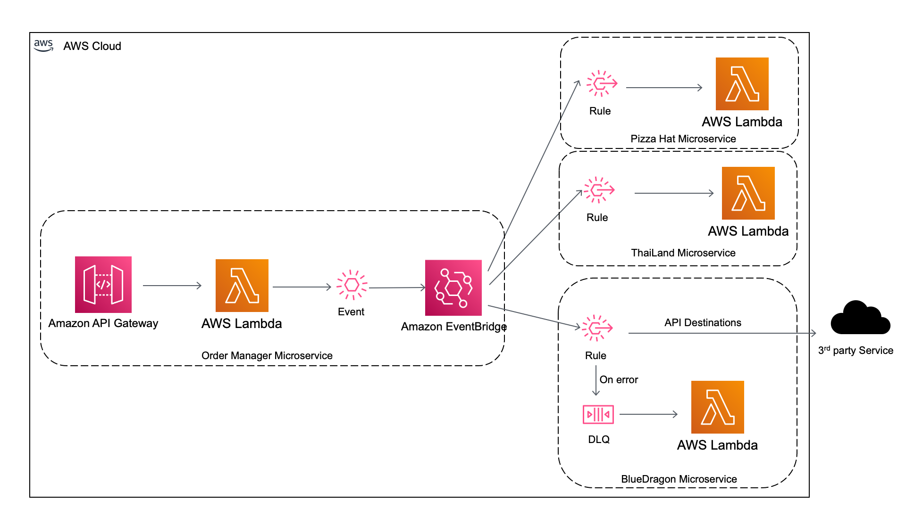

# AWS SAM - AWS EventBridge Demo

_Infrastructure as code framework used_: AWS SAM

_AWS Services used_: AWS Lambda, API Gateway, AWS EventBridge

## Summary of the demo

This demo is organized in multiple branches.

In the [main branch](https://github.com/mavi888/sam-eventbridge) of this demo you will see:

- How to create a simple microservice application using AWS SAM, that uses AWS EventBridge as at messaging between microservices.
- 2 different ways to define the AWS EventBridge rules using AWS SAM (Thailand) and AWS Cloudformation (pizzaHat service).

In the [api-destinations](https://github.com/mavi888/sam-eventbridge/tree/api-destinations) branch of this demo you will see:

- How to use EventBridge API Destinations
- How do define them using AWS SAM

In the [video3](https://github.com/mavi888/sam-eventbridge/tree/video3) branch of this demo you will see:

- How to create a dead letter queue for EventBridge

This demo is part of a video posted in FooBar Serverless channel. You can check the video to see the whole demo.

## Architecture

### Main branch

The [main branch](https://github.com/mavi888/sam-eventbridge) of this project has a simple application where you can send food orders to different restaurants based on an API Request. And using EventBridge each restaurant will recieve the right order. You can extend this just by adding more restaurants microservice. Each restaurant is in control of their EventBridge rule, in this way we keep the whole application very decoupled.



### Api-Destinations branch

The [api-destinations branch](https://github.com/mavi888/sam-eventbridge/tree/api-destinations) adds a new microservice called BlueDragon in which we use [EventBrigde API Destinations feature](https://docs.aws.amazon.com/eventbridge/latest/userguide/eb-api-destinations.html). In which you can just call a 3rd party API directly from an EventBridge rule.



### Dead Letter Queue branch

The [video3](https://github.com/mavi888/sam-eventbridge/tree/video3) branch of this demo adds a [Dead Letter Queue for the EventBridge rule](https://docs.aws.amazon.com/eventbridge/latest/userguide/eb-rule-dlq.html). Now if there is any problem calling the 3rd party API, the message will get stored in a SQS Queue. In this demo when there is a new message in the SQS queue a Lambda function will get triggered to do something with the message.



## Deploy this demo

You will need to deploy each microservice individually - orderManager, pizzaHat and Thailand (and if you are not in main branch also BlueDragon).

We will be using AWS SAM and make sure you are running the latest version - at the time of writing, this was 1.37.0 (sam --version).

Deploy the project to the cloud:

```
sam deploy -g # Guided deployments
```

When asked about functions that may not have authorization defined, answer (y)es. The access to those functions will be open to anyone, so keep the app deployed only for the time you need this demo running.

Next times, when you update the code, you can build and deploy with:

```
sam deploy
```

To delete the app:

```
sam delete
```

## Links related to this code

- Video #1 [main branch](https://github.com/mavi888/sam-eventbridge) - [Get started with AMAZON EVENTBRIDGE, build your SERVERLESS event-driven app with AWS SAM](https://youtu.be/c493KFaWteg)
- Video #2 [api-destinations branch](https://github.com/mavi888/sam-eventbridge/tree/api-destinations) - [Build Event-driven applications using 3rd party APIs - Amazon EventBridge API Destinations](https://youtu.be/tyNoiravCNw)
- Video #3 [video3 branch](https://github.com/mavi888/sam-eventbridge/tree/video3) - [What to DO when an EVENT DELIVERY FAILS? - Dead Letter Queues with Amazon EventBridge](https://youtu.be/heJbgToU04c)
